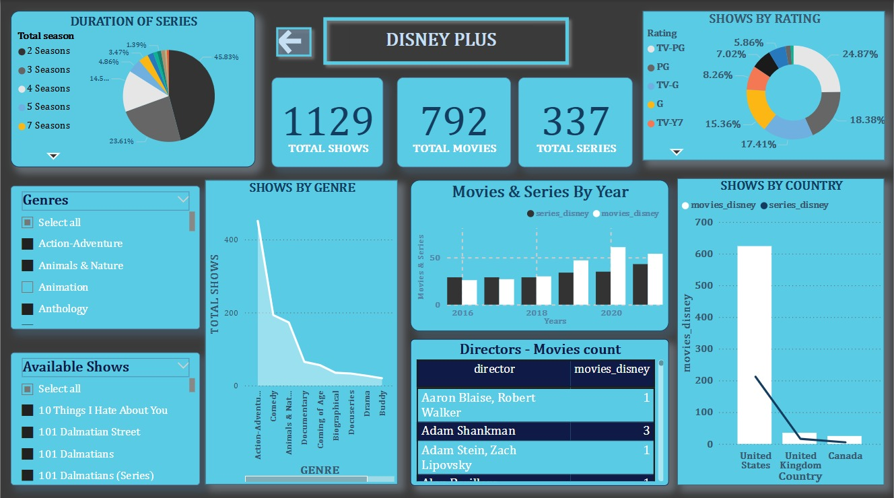

# Visual-Stream

## OTT Platform Dashboard Comparison - Netflix vs Amazon Prime vs Disney+

This project provides a visual comparative analysis of the top OTT platforms — **Netflix**, **Amazon Prime**, and **Disney+** using interactive dashboards.

---

## Project Overview

This dashboard project showcases:
- Total number of shows, movies, and series
- Genre breakdown
- Duration of shows/series
- Ratings distribution
- Content release trends over the years
- Hidden gem scores
- Director-wise and country-wise distribution

Built to help users, data analysts, or streaming service stakeholders quickly gain insights into the content libraries and trends across these popular platforms.

---

## Screenshots

### Netflix Dashboard  

### Amazon Prime Dashboard  

### Disney Plus Dashboard  

---
